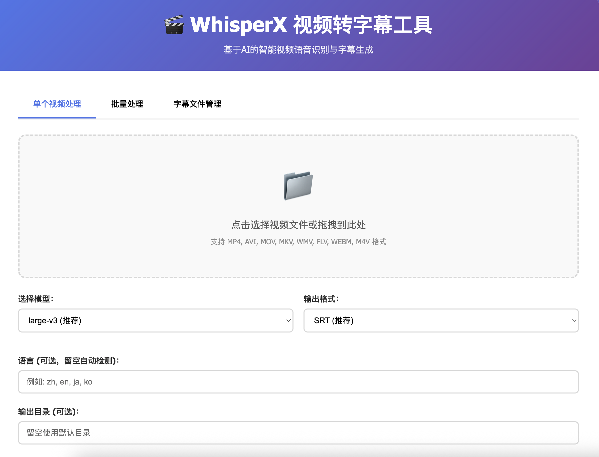
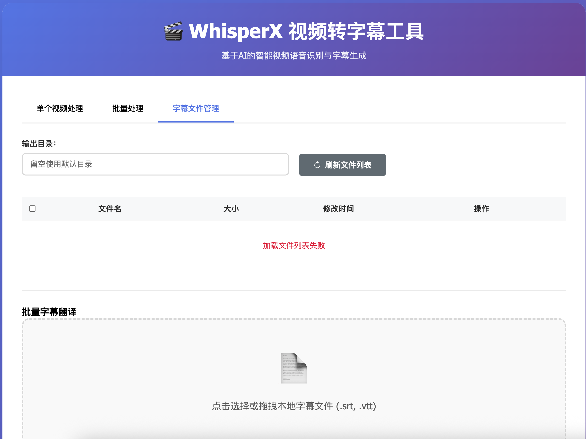

# WhisperX 视频转字幕 Web 工具

基于 WhisperX 的智能视频语音识别与字幕生成 Web 应用，支持批量处理和多种输出格式。



## 功能特性

- 🎬 **视频转字幕**: 支持多种视频格式的语音识别
- 📁 **批量处理**: 一次上传多个视频文件进行批量转录
- 🎯 **模型选择**: 支持 tiny 到 large-v3 多种模型选择
- 📝 **多格式输出**: 支持 SRT、VTT、JSON、TXT 格式
- 🌍 **多语言支持**: 自动语言检测或手动指定语言
- 📂 **文件管理**: 在线查看和下载生成的字幕文件
- 🎨 **现代化界面**: 美观易用的 Web 界面

## 支持的视频格式

- MP4, AVI, MOV, MKV, WMV, FLV, WEBM, M4V

## 支持的模型

- **tiny**: 最快，准确度较低
- **base**: 快速，准确度一般
- **small**: 平衡速度和准确度
- **medium**: 较好的准确度
- **large**: 高准确度
- **large-v2**: 更高准确度
- **large-v3**: 最高准确度（推荐）

## 安装和运行

### 1. 环境要求

确保您已经安装了 conda 并创建了 whisperx 环境：

```bash
# 激活 whisperx 环境
conda activate whisperx
```

### 2. 安装依赖

```bash
# 安装项目依赖
pip install -r requirements.txt
```

### 3. 运行应用

```bash
# 启动 Web 服务器
python app.py
```

应用将在 `http://localhost:5000` 启动。

## 使用方法

### 单个视频处理

1. 打开浏览器访问 `http://localhost:5000`
2. 选择"单个视频处理"标签
3. 上传视频文件（支持拖拽）
4. 选择模型和输出格式
5. 可选：指定语言和输出目录
6. 点击"开始处理"
7. 处理完成后下载字幕文件

### 批量处理

1. 选择"批量处理"标签
2. 上传多个视频文件
3. 设置处理参数
4. 点击"开始批量处理"
5. 查看处理结果并下载文件

### 文件管理

1. 选择"字幕文件管理"标签
2. 查看已生成的字幕文件
3. 下载需要的文件
4. 可指定自定义输出目录

## API 接口

### 获取可用模型

```http
GET /api/models
```

### 单个视频转录

```http
POST /api/transcribe
Content-Type: multipart/form-data

video: 视频文件
model: 模型名称 (可选，默认 large-v3)
language: 语言代码 (可选)
format: 输出格式 (可选，默认 srt)
output_dir: 输出目录 (可选)
```

### 批量视频转录

```http
POST /api/batch-transcribe
Content-Type: multipart/form-data

videos: 视频文件列表
model: 模型名称 (可选，默认 large-v3)
language: 语言代码 (可选)
format: 输出格式 (可选，默认 srt)
output_dir: 输出目录 (可选)
```

### 下载字幕文件

```http
GET /api/download/{filename}
```

### 获取文件列表

```http
GET /api/files?output_dir={目录路径}
```

## 输出格式说明

### SRT 格式
```
1
00:00:00,000 --> 00:00:03,000
这是第一段字幕

2
00:00:03,000 --> 00:00:06,000
这是第二段字幕
```

### VTT 格式
```
WEBVTT

00:00:00.000 --> 00:00:03.000
这是第一段字幕

00:00:03.000 --> 00:00:06.000
这是第二段字幕
```

### JSON 格式
包含完整的转录结果，包括时间戳、置信度等信息。

### TXT 格式
纯文本格式，只包含转录的文字内容。

## 配置说明

### 文件大小限制
默认支持最大 16GB 的视频文件，可在 `app.py` 中修改：

```python
app.config['MAX_CONTENT_LENGTH'] = 16 * 1024 * 1024 * 1024  # 16GB
```

### 输出目录
- 默认输出目录：`outputs/`
- 上传临时目录：`uploads/`
- 可在处理时指定自定义输出目录

### 设备配置
- 自动检测 CUDA 可用性
- GPU 可用时使用 CUDA + float16
- CPU 模式使用 int8 计算

## 性能优化建议

1. **模型选择**: 
   - 快速处理：使用 tiny 或 base 模型
   - 高质量：使用 large-v3 模型

2. **批量处理**: 
   - 建议一次处理 5-10 个文件
   - 大文件建议单独处理

3. **硬件要求**:
   - GPU: 推荐使用 NVIDIA GPU 加速
   - 内存: 建议 8GB+ RAM
   - 存储: 确保有足够空间存储视频和字幕文件

## 故障排除

### 常见问题

1. **CUDA 不可用**
   - 检查 GPU 驱动和 CUDA 安装
   - 应用会自动回退到 CPU 模式

2. **内存不足**
   - 使用较小的模型（tiny/base）
   - 减少批量处理文件数量

3. **文件上传失败**
   - 检查文件格式是否支持
   - 确认文件大小在限制范围内

4. **转录质量不佳**
   - 尝试使用更大的模型
   - 指定正确的语言参数
   - 检查音频质量

## 许可证

本项目基于 MIT 许可证开源。

## 贡献

欢迎提交 Issue 和 Pull Request 来改进这个项目。 